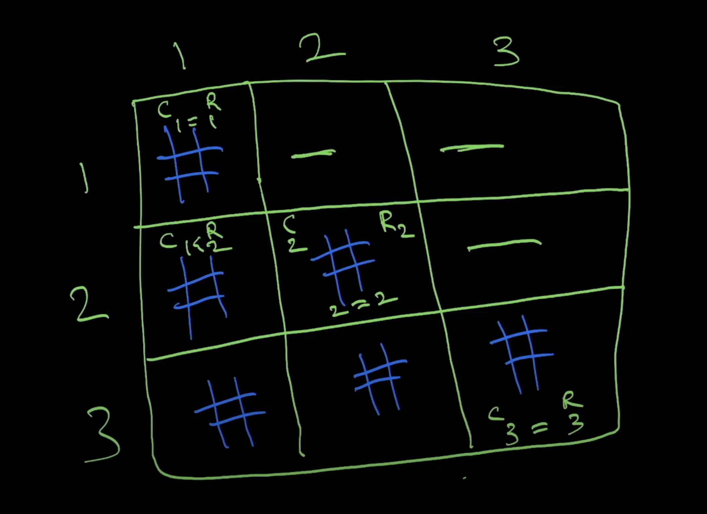

# js-coding-interview-questions

This repo has been created in support for the Coding Money tutorial videos on youtube. If you want to follow along check out the youtube channel at: http://youtube.com/CodingMoney

... 1:30:53 / 1:52:52

Top 10 Javascript Algorithms to Prepare for Coding Interviews

https://www.youtube.com/watch?v=ufBbWIyKY2E&t=602s

---

logic of what I want in

8-steps-string-pattern.js

the logic of the pyramid

